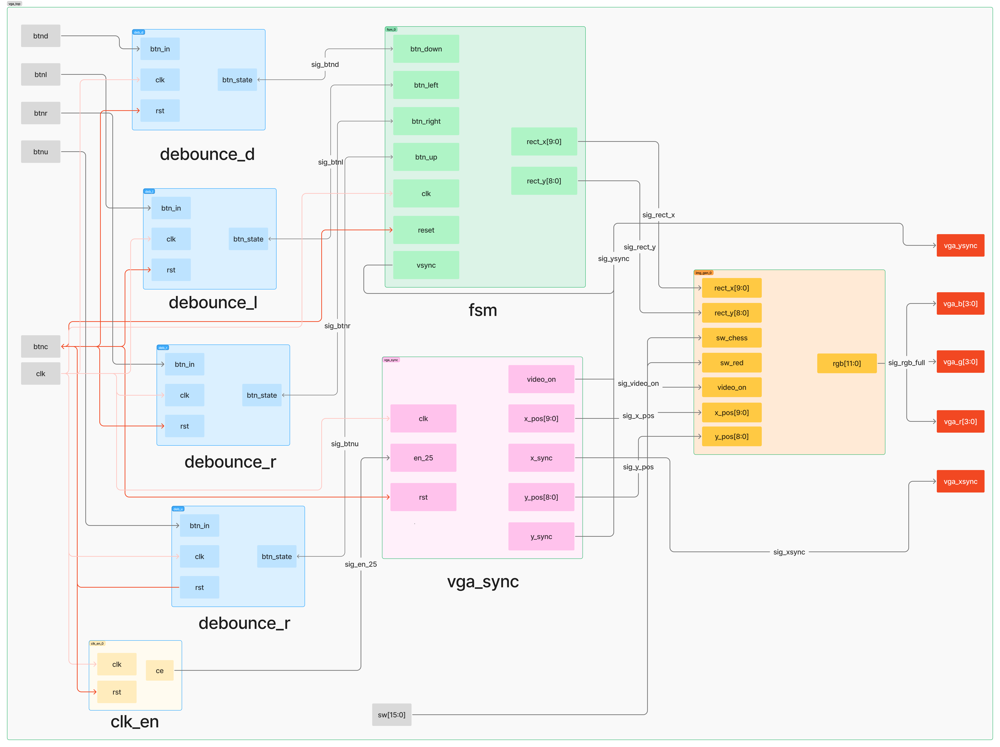
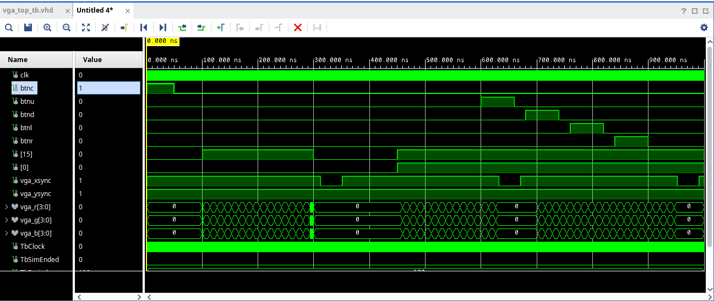
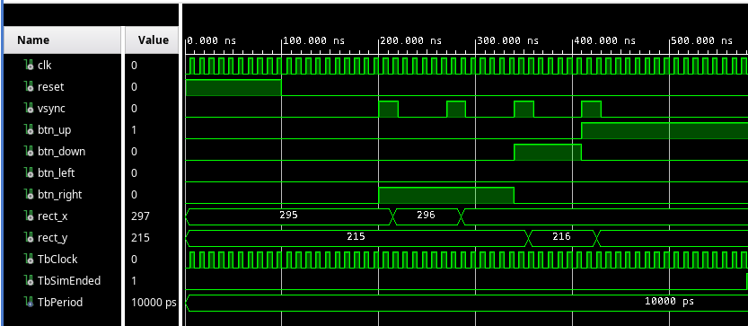
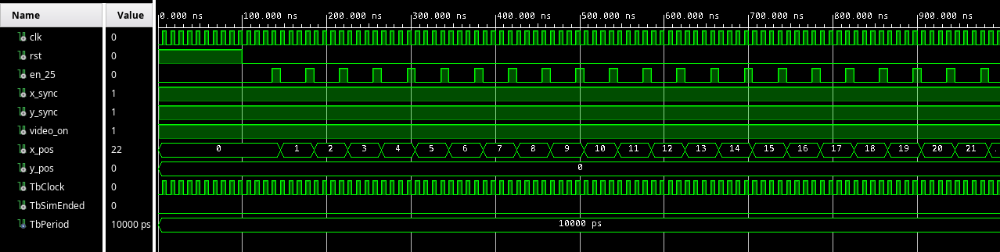
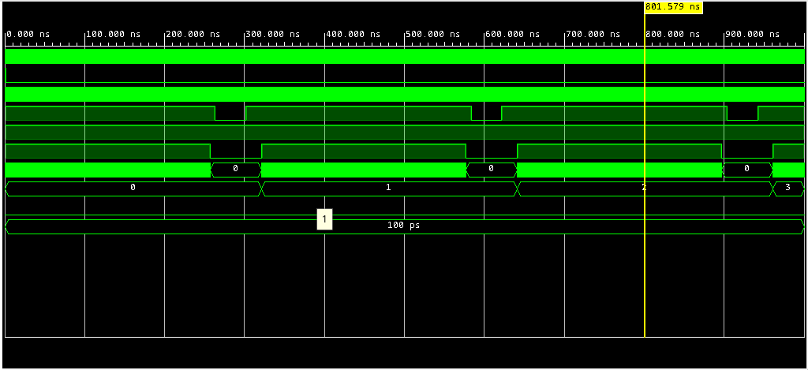
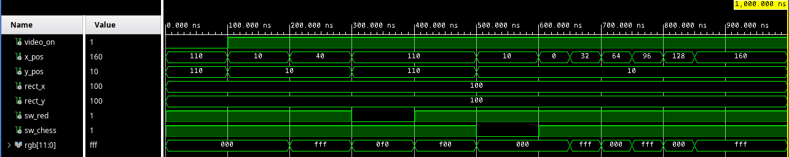
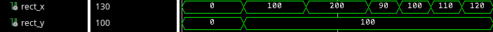
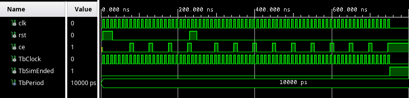
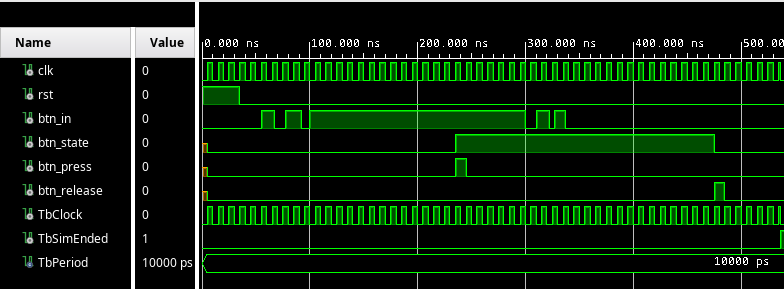
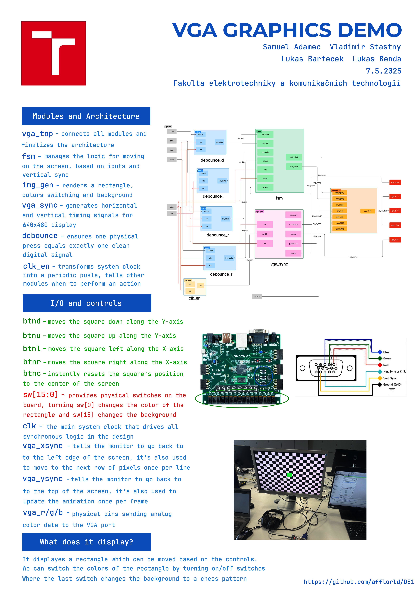

# VGA Graphics Demo

VGA Graphics Controller (Nexys A7-50T)

This VHDL project implements a VGA controller generating a 640x480 @ 60Hz video signal. It demonstrates VGA synchronization, combinational image generation (static shapes, patterns), and sequential logic for object animation with boundary collision detection.

## Controls

The system displays a colored square on a black background by default. The behavior can be controlled using the onboard push buttons:

* **Button up (Press/Hold):**
* **Button down (Press/Hold):**
* **Button right (Press/Hold):**
* **Button left (Press/Hold):**
* **Button center (Press):**
* **Switches (Turn on/off):**

# Schematic

---

# Inputs and Outputs

The inputs and outputs of the design are as follows:

* **BTND:** Moves the square down the Y-axis. Movement stops when the button is released or the screen edge is reached.
* **BTNR:** Moves the square to the right along the X-axis. Movement stops when the button is released or the screen edge is reached.
* **BTNL:** Moves the square to the left along the X-axis. Movement stops when the button is released or the screen edge is reached.
* **BTNC:** Instantly resets the square's position to the center of the screen. 
* **SW[15:0]:** It provides user input from the physical switches on the board. The left switches are used to change the background pattern. The right switches are used to change the color of the square.
* **clk:** The main system clock that drives all synchronous logic in the design.
* **vga_xsync:** It tells the monitor to go back to the left edge of the screen. It is also used to move to the next row of pixels once per line.
* **vga_ysync:** It tells the monitor to go back to the top of the screen. It is also used to update the animation once per frame.
* **vga_r, vga_g, vga_g:** The physical pins sending analog color data to the VGA port.

# Modules
Description of each module used in the design.

## [Top module](vga_graphics_demo/vga_graphics_demo.srcs/sources_1/new/vga_top.vhd)

This module connects all the previous modules together and maps the internal signals to the physical pins on the FPGA board. It serves as the final integration point where all components work together to produce the VGA output.

### Ports

| Port Name | Direction | Size/Type | Description |
| :--- | :--- | :--- | :--- |
| `clk` | In | `std_logic` | Main system clock for synchronous logic |
| `btn[c/u/d/l/r]` | In | `std_logic` | The physical push-buttons on the board |
| `sw` | In | `std_logic_vector(15:0)` | The physical switches on the board |
| `vga_xsync` | Out | `std_logic` | The physical HSYNC pin wired to the VGA port |
| `vga_ysync` | Out | `std_logic` | The physical VSYNC pin wired to the VGA port |
| `vga_r`, `vga_g`, `vga_b` | Out | `std_logic_vector(3:0)` | The physical pins sending analog color data to the VGA port. |

### Signals

| Signal Name | Size/Type | Description |
| :--- | :--- |  :--- |
| `sign_en25` | `std_logic` | The 25 MHz clock enable pulse generated by `clk_en` |
| `sig_vsync` | `std_logic` | The VSYNC pulse from `vga_sync` used to synchronize the FSM |
| `sig_video_on` | `std_logic` | The video on/off flag from `vga_sync` used to control the output color in `img_gen` |
| `sig_x_pos` | `std_logic_vector(9:0)` | The current horizontal pixel coordinate from `vga_sync` used by `img_gen` to determine the color of the current pixel |
| `sig_y_pos` | `std_logic_vector(8:0)` | The current vertical pixel coordinate from `vga_sync` used by `img_gen` to determine the color of the current pixel |
| `sig_rect_x` | `std_logic_vector(9:0)` | The current X-coordinate of the moving rectangle calculated by the FSM |
| `sig_rect_y` | `std_logic_vector(8:0)` | The current Y-coordinate of the moving rectangle calculated by the FSM |
| `sig_btn[u/d/l/r]` | `std_logic` | The debounced signals from the push buttons used by the FSM to control the movement of the rectangle |
| `sig_rgb_full` | `std_logic_vector(11:0)` | The final 12-bit RGB color generated by `img_gen` before being sent to the VGA output |

### Simulation

## [fsm](vga_graphics_demo/vga_graphics_demo.srcs/sources_1/new/fsm.vhd) - Finite State Machine module

The FSM acts as the "logic brain" of the project, responsible for calculating the rectangle's position and handling user input. To prevent the rectangle from moving at the internal 100 MHz clock speed (which would be too fast to see), the FSM is synchronized with the vsync signal. This ensures the position updates only once per frame, resulting in a smooth 60 Hz movement.

### Ports

| Port Name | Direction | Size/Type | Description |
| :--- | :--- | :--- | :--- |
| `clk` | In | `std_logic` | Main system clock for synchronous logic |
| `reset` | In | `std_logic` | Returns the animated object to its starting position |
| `vsync` | In | `std_logic` | The VSYNC pulse from `vga_sync`. We use this as a slow 60Hz timer so the object moves exactly 1 step per frame, creating smooth animation |
| `btn_down, _left, _right, _up` | In | `std_logic` | Clean button signals used to steer the object or change the animation state |
| `rect_x` | Out | `std_logic_vector(9:0)` | The calculated X-coordinate where the object should be right now |
| `rect_y` | Out | `std_logic_vector(8:0)` | The calculated Y-coordinate where the object should be right now |

### Signals

| Signal Name | Size/Type | Description |
| :--- | :--- | :--- |
| `current_state` | `std_logic_vector(1:0)` | The current state of the FSM, used to determine the movement direction and behavior of the rectangle |
| `x_reg` | `std_logic_vector(9:0)` | The internal register holding the current X-coordinate of the rectangle |
| `y_reg` | `std_logic_vector(8:0)` | The internal register holding the current Y-coordinate of the rectangle |

### Enumeration Types

| Type name| Description |
| :--- | :--- |
| `state_type` | An enumerated type defining the possible states of the FSM, such as `IDLE`, `MOVE_RIGHT`, `MOVE_DOWN`, `MOVE_LEFT`, and `MOVE_UP`. Each state corresponds to a specific movement direction or behavior of the rectangle. |

### [Simulation](vga_graphics_demo/vga_graphics_demo.srcs/sim_1/new/fsm_tb.vhd)

## [vga_sync](vga_graphics_demo/vga_graphics_demo.srcs/sources_1/new/vga_sync.vhd) - VGA Synchronization module
Acts as the timing core of the video controller, ensuring that pixels are sent to the monitor in the correct order and at the precise rate required by the VGA standard. It handles the transition from a 1D stream of pixel data into a 2D 640×480 frame.

The module utilizes a nested counter system to track the "scanning" position. The horizontal counter (x_cnt) counts from 0 up to 799, and the vertical counter (y_cnt) increments every time a full row is completed, counting from 0 up to 524. While the total area is 800×525 pixels, only the first 640×480 region is visible. The remaining "non-visible" areas—known as the front porch, sync pulse, and back porch—are used to reset the monitor's timing.

### Ports

| Port Name | Direction | Size/Type | Description |
| :--- | :--- | :--- | :--- |
| `clk` | In | `std_logic` | Main system clock |
| `rst` | In | `std_logic` | Resets the  horizontal and vertical counters to zero |
| `en_25` | In | `std_logic` | The 25 MHz pulse from `clk_en` that drives the pixel counting |
| `x_sync` | Out | `std_logic` | Horizontal sync pulse - HSYNC. Tells the monitor to move the brush to the next line |
| `y_sync` | Out | `std_logic` | Vertical sync pulse - VSYNC. Tells the monitor to start a completely new frame at the top left |
| `video_on` | Out | `std_logic` | A safety flag. It is '1' only when the monitor is in the active display area. If it is '0', we must output black to prevent monitor errors |
| `x_pos` | Out | `std_logic_vector(9:0)` | The current horizontal coordinate of the monitor's brush (0 to 639) |
| `y_pos` | Out | `std_logic_vector(8:0)` | The current vertical coordinate of the monitor's brush (0 to 479) |

### Signals

| Signal Name | Size/Type | Description |
| :--- | :--- | :--- |
| `x_cnt` | `std_logic_vector(9:0)` | The horizontal pixel counter that increments with each pixel clock. It resets after reaching 799, which includes the visible area (0-639) and the horizontal blanking intervals (640-799). |
| `y_cnt` | `std_logic_vector(8:0)` | The vertical pixel counter that increments each time `x_cnt` resets. It counts from 0 to 524, covering the visible area (0-479) and the vertical blanking intervals (480-524). |

### Simulation

---

## [img_gen](vga_graphics_demo/vga_graphics_demo.srcs/sources_1/new/img_gen.vhd) - Image Generation module
This module is a combinational logic block. It determines the final 12-bit RGB color for every pixel based on the current coordinates provided by the synchronization module.

### Ports

| Port Name | Direction | Size/Type | Description |
| :--- | :--- | :--- | :--- |
| `video_on` | In | `std_logic` | The safety flag. If this is '0', the module overrides everything and outputs black screen |
| `x_pos`, `y_pos` | In | `std_logic_vector` | The exact pixel the monitor is asking us to color at the moment |
| `rect_x`, `rect_y` | In | `std_logic_vector` | The target coordinates of our moving object, provided by the FSM brain |
| `sw_red`, `sw_chess` | In | `std_logic_vector` | The user input from the switches that can change the background pattern and the color of the object |
| `rgb` | Out | `std_logic_vector(11:0)` | The final 12-bit color code - 4 bits Red, 4 bits Green, 4 bits Blue that are sent to the screen |

### Simulation

---

## [clk_en](vga_graphics_demo/vga_graphics_demo.srcs/sources_1/new/clk_en.vhd) - Clock Enable module
To drive other logic in the design that requires a slower operation, it is better to generate a clock enable signal (see figure bellow) instead of creating a new clock domain using clock dividers. 
Creating additional clock domains may cause timing issues or clock domain crossing (CDC) problems such as metastability, data loss, and data incoherency.

Source: https://github.com/tomas-fryza/vhdl-examples/tree/master/lab4-counter

### Ports

| Port Name | Direction | Size/Type | Description |
| :--- | :--- | :--- | :--- |
| `clk` | In | `std_logic` | The very fast 100 MHz main system clock from the board |
| `rst` | In | `std_logic` | Reset signal to restart the internal counter |
| `ce` | Out | `std_logic` | Clock enable pulse. It ticks exactly at 25 MHz |

### Signals
| Signal Name | Size/Type | Description |
| :--- | :--- | :--- |
| `sig_cnt` | `std_logic_vector(1:0)` | A 2-bit counter that increments with each clock cycle. It resets to zero when it reaches 3, creating a pulse every 4 cycles (100 MHz / 4 = 25 MHz). |

### Simulation

## [debounce](vga_graphics_demo/vga_graphics_demo.srcs/sources_1/new/debounce.vhd) - Debounce module 
A bouncy button, also known as a switch bounce, refers to the phenomenon where the electrical contacts in a mechanical switch make multiple rapid transitions between open and closed states when pressed or released. These transitions typically occur over a period of 1–25 ms.

As a result, a single press may be interpreted by digital logic as multiple presses, which can cause incorrect behavior in digital circuits. Examples of real push buttons are shown below. (Note that the active level of the buttons in these examples is low, while the buttons on the Nexys A7 board may use a different active level.)

---

Source: https://github.com/tomas-fryza/vhdl-examples/tree/master/lab6-debounce

### Ports

| Port Name | Direction | Size/Type | Description |
| :--- | :--- | :--- | :--- |
| `btn_in` | In | `std_logic` | The raw electrical signal coming directly from the physical push button |
| `rst` | In | `std_logic` | Asynchronous reset to clear the internal state of the filter |
| `clk` | In | `std_logic` | The main system clock used to time the filtering process |
| `btn_state` | Out | `std_logic` | The stable signal representing a true button press. Safe to use without registering fake multiple clicks |
| `btn_press` | Out | `std_logic` | A one-clock-cycle pulse that goes high only on the transition from unpressed to pressed. Useful for triggering events on button presses without needing to check the state continuously. |
| `btn_release` | Out | `std_logic` | A one-clock-cycle pulse that goes high only on the transition from pressed to unpressed. Useful for triggering events on button releases. |

### Signals

| Signal Name | Size/Type | Description |
| :--- | :--- | :--- |
| `ce_sample` | `std_logic` | A slower clock enable signal that determines how often the button state is sampled. This is typically set to a frequency that allows for effective debouncing (e.g., 1 kHz). |
| `sync0`, `sync1` | `std_logic` | Two-stage synchronizer flip-flops used to safely bring the asynchronous button signal into the clock domain of the system, reducing the risk of metastability. |
| `shift_reg` | `std_logic_vector(15:0)` | A shift register that holds the history of sampled button states. By analyzing the contents of this register, the module can determine if the button has been consistently pressed or released for a sufficient duration to be considered stable. |
| `debounced` | `std_logic` | The output signal that indicates the debounced state of the button. It is set to '1' when the button is considered pressed and '0' when it is considered released. |
| `delayed` | `std_logic` | A delayed version of the debounced signal used to detect transitions. By comparing the current debounced state with the previous state, the module can generate the `btn_press` and `btn_release` pulses. |

### Simulation

# Poster

Pdf version of the poster: [poster.pdf](./.dotfiles/poster.pdf)

# Video

# Authors
Samuel Adamec 
Lukas Benda 
Lukas Bartecek 
Vladimir Stastny

