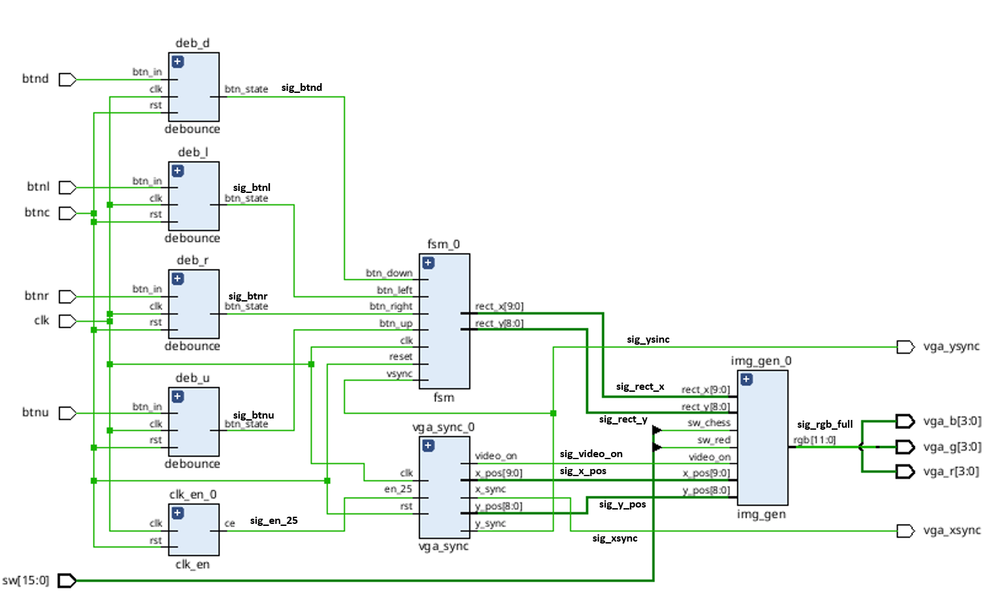

# VGA Graphics Demo

VGA Graphics Controller (Nexys A7-50T)

This VHDL project implements a VGA controller generating a 640x480 @ 60Hz video signal. It demonstrates VGA synchronization, combinational image generation (static shapes, patterns), and sequential logic for object animation with boundary collision detection.

## Features & Controls

The system displays a colored square on a black background by default. The behavior can be controlled using the onboard push buttons:

**INPUT** 

* **Default State:** A static square is displayed in the exact center of the monitor.
* **BTNU (Press/Hold):** Displays a full-screen checkerboard pattern. Used to test VGA synchronization and pixel sharpness.
* **BTND (Press/Hold):** Animates the square. The square moves along the X-axis and automatically bounces off the screen edges. Releasing the button pauses the animation at the current position.
* **BTNR (Press/Hold):** Resets the square back to its initial center coordinates.
* **BTNL (Press/Hold):** Moves the square to the left along the X-axis. Movement stops when the button is released or the screen edge is reached.
* **BTNC (Press):** Instantly resets the square's position to the center of the screen. 
* **SW[15:0]: (Switch)** It provides user input from the physical switches on the board. The left switche are used to change the drawing pattern. The right switche are used to change the color.

**OUTPUT** 

* **vga_xsync:** It tells the monitor to go back to the left edge of the screen. It is also used to move to the next row of pixels once per line.
* **vga_ysync:** It tells the monitor to go back to the top of the screen. It is also used to update the animation once per frame.
* **vga_r, vga_g, vga_g:** The physical pins sending analog color data to the VGA port.

Detailed descriptions of the modules used in the design can be found in the [VGA.md](.dotfiles/VGA.md) file.

# Schematic

# Video

# Authors
Samuel Adamec 
Lukas Benda 
Lukas Bartecek 
Vladimir Stastny

